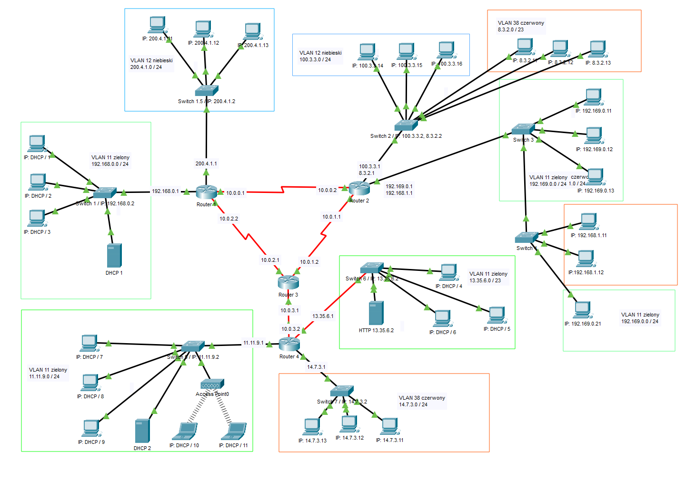
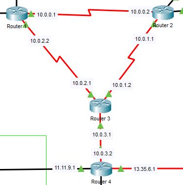
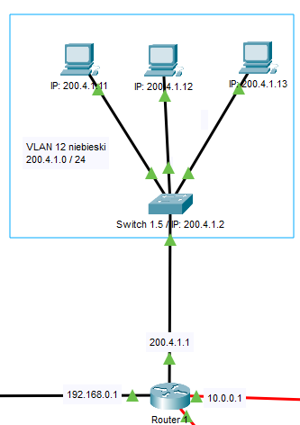

# LAN-symulacja
Przykładowy projekt lokalnej sieci komputerowej. Symulacja została stworzona przy użyciu oprgoramowania Cisco Packet Tracer 8.1.

## 1.Topologia sieci

## 2.Użyte technologie i rozwiązania:

### Routery centralne + RIPv2

Routery komunikują się między sobą w ramach czterech sieci.
Każde połączenia dwóch routerów to osobna sieć, do której należy
jeden z interfejsów routera. W tym przypadku routery połączone
są złączem Serial DTE.
W wszystkich routerach aktywna jest usługa RIPv2, która
wyznacza ścieżkę pakietom przesyłanym pomiędzy różnymi sieciami,
do poprawnego działania tej usługi należy w każdym routerze
przypisać tej usłudze wszystkie podsieci, którym chcemy
umożliwić komunikację, jak i sieci pośredniczące w komunikacji
między nimi (podsieci, które stoją na drodze połączenia między
którymiś z podsieci, które mają się komunikować).
 

### Pojedynczy VLAN

Adresy IP komputerów ustawione są statycznie. Komputery
połączone ze switchem oraz router należą do jednego VLANu, w
ramach którego się komunikują. Gdy adres docelowy pakietu jest
adresem spoza sieci bramka sieciowa wskaże by wysłać go do
routera, który następnie przekaże go dalej.

