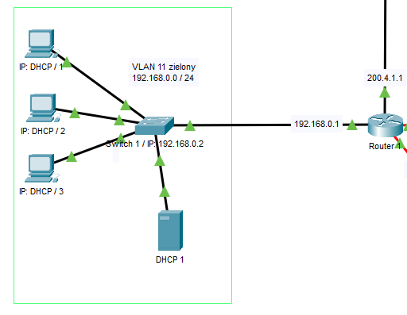
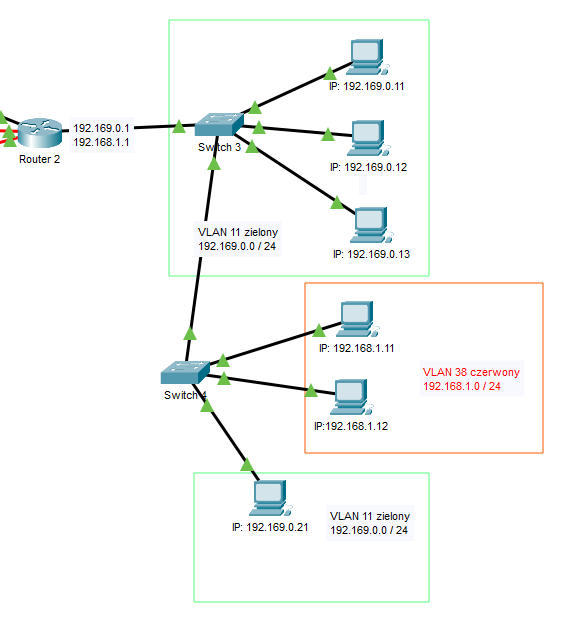

# LAN - symulacja
Przykładowy projekt lokalnej sieci komputerowej. Symulacja została stworzona przy użyciu oprgoramowania Cisco Packet Tracer 8.1.
<br/>
<br/>


## 1.Topologia sieci

<br clear="all" />
<br/>
<br/>

## 2.Użyte technologie i rozwiązania:

### Routery centralne + RIPv2

Routery komunikują się między sobą w ramach czterech sieci. Każde połączenia dwóch routerów to osobna sieć, do której należy jeden z interfejsów routera. W tym przypadku routery połączone są złączem Serial DTE.

<br/>
<br/>

We wszystkich routerach aktywna jest usługa RIPv2, która wyznacza ścieżkę pakietom przesyłanym pomiędzy różnymi sieciami, do poprawnego działania tej usługi należy w każdym routerze przypisać tej usłudze wszystkie podsieci, którym chcemy umożliwić komunikację, jak i sieci pośredniczące w komunikacji między nimi (podsieci, które stoją na drodze połączenia między którymiś z podsieci, które mają się komunikować).
<br clear="all" />


<br/><hr style="border:2px solid gray">


### Pojedynczy VLAN

Adresy IP komputerów ustawione są statycznie. Komputery połączone ze switchem oraz router należą do jednego VLANu, w ramach którego się komunikują. Gdy adres docelowy pakietu jest adresem spoza sieci bramka sieciowa wskaże by wysłać go do routera, który następnie przekaże go dalej.
<br clear="all" />


<br/><hr style="border:2px solid gray">


### Serwer DHCP

Dany przykład podobnie jak powyższy z tą różnicą że do switcha podłączony jest serwer DHCP. Serwer DHCP posiada statyczne IP i przypisuje adresy urządzeniom w sieci, adresy pula adresów wyklucza 10 pierwszych adresy, które może użyć na podłączenie ewentualnych urządzeń preferujących statyczny adres IP.
<br clear="all" />


<br/><hr style="border:2px solid gray">


### Trunking + wiele VLANów

W obu switchach zostały stworzone dwa VLANy, które posiadają wydzielony interfejsy, do których następnie zostały podłączone odpowiednie komputery, adresy tych komputerów są przypisane statycznie. Switche zostały połączone ze sobą poprzez interfejsy, na których została zastosowane połączenie typu trunk. Na połączeniu switcha z routerem również zostało zastosowane połączenie typu trunk (na interfejsie switcha). Router natomiast na 	interfejsie łączącym go ze switchem posiada wydzielone wirtualne interfejsy, które odpowiadają za łączność każdej podsieci w widocznej części sieci.  
<br clear="all" />


<br/><hr style="border:2px solid gray">


### Access Point

Do switcha został podłączony Access Point, który pozwala na przyłączenie do sieci urządzeń za pomocą technologii bezprzewodowej (w tym przypadku WIFI). Urządzenia połączone bezprzewodowo również uzyskują adresy z obecnego w sieci serwera DHCP. 
<br clear="all" />


<br/><hr style="border:2px solid gray">


### Serwer HTTP

Do switcha został podłączony serwer HTTP o statycznym adresie IP, hostowaną przez niego stronę internetową można przeglądać z każdego miejsca w sieci wpisując w wyszukiwarkę jego adres IP.
<br clear="all" />


<br/><hr style="border:2px solid gray">

### SSH
Wszystkie routery i switche w sieci posiadają skonfigurowany protokół SSH umożliwiający zdalne łączenie się z tymi urządzeniami co umożliwia ich zdalną konfiguracje. Połączenie SSH jest tylko możliwe gdy klient znajduję się w tej samej sieci co serwer. Dane logowania są takie same dla wszystkich urządzeń i są następujące:

Dane logowania:
```
user:		admin
password:	admin
```

Aby połączyć się z wybranym urządzeniem należy użyć polecenia:
```ssh -l [user] [target]```


Gdzie target to:
- w przypadku łączenia się z switchem - adres IP VLANu switcha, w którym znajduje się urządzenia klienta.
- w przypadku się z routerem - adres IP interfejsu lub wirtualnego interfejsu routera, który należy do sieci, w której znajduje się urządzenia klienta.

<br clear="all" />


<br/><hr style="border:2px solid gray">

## 3. Konfiguracja urządzeń
[I'm a relative reference to a repository file](konfiguracje)
